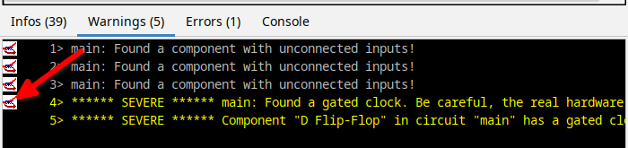
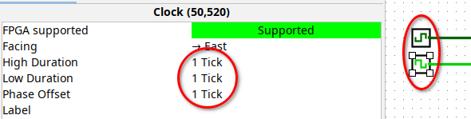
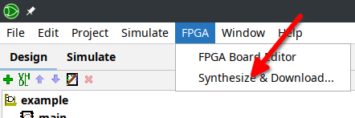
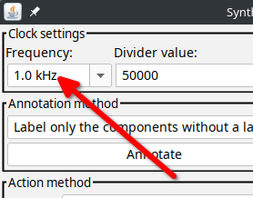
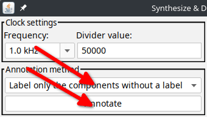
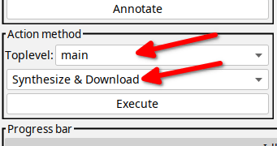
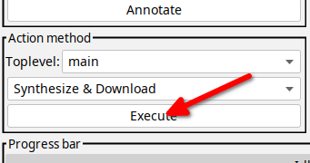
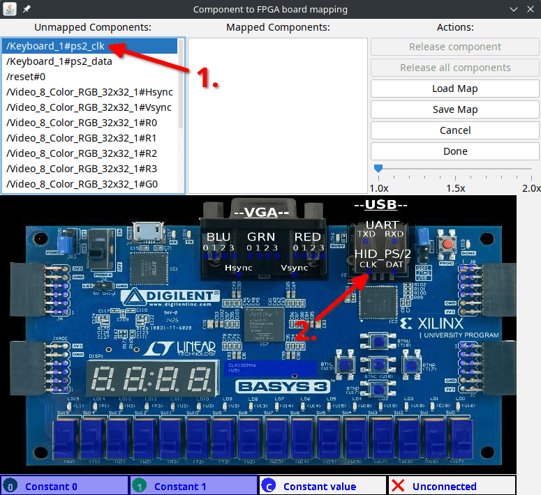
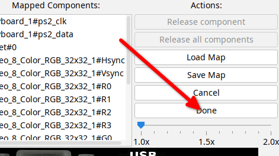
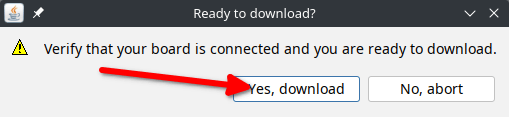

# Logisim Evolution Basys3 User Manual

## Starting Logisim Evolution

Since a patched version of the newest development version of Logisim Evolution is needed, don't use official releases. Instead, use the patched version provided in this repository. To start Logisim Evolution, run the run script:
```bash
$ /path/to/logisim-evolution-basys3/run.sh
```

## Things to consider when designing circuits

In order for the circuit to run without issues on the Basys3 FPGA board, the following things should be considered:

### Don't use "gated clocks"

All clock inputs must be connected directly to a clock component, without intermediate logic gates. Tunnels and pins are allowed, but there must be no logic gate between clock input and clock component.

If a gated clock is used, the circuit downloaded to the FPGA may not behave in the same way as in Logisim.

If Logisim detects a gated clock in the circuit, a warning is displayed in the synthesis window under the **Warnings** tab after the execute step in [Synthesizing and downloading a circuit to the Basys3 FPGA board](#synthesizing-and-downloading-a-circuit-to-the-basys3-fpga-board):\
**Found a gated clock. Be careful, the real hardware may not work correctly.**\
and \
**Component "\*" in circuit "\*" has a gated clock connection!**\
By clicking on the symbol to the left of the warning in the **Warnings** tab, the component that generated the warning is marked in the circuit diagram.\


In particular, this means that two clock signals that are the inverse of each other cannot be realized by an inverter gate. Instead, two clock components with a phase offset can be used (set **High Duration** and **Low Duration** to the same value for both clock components and set **Phase Offset** to this value for one of the two clock components and to 0 for the other):\
\


### Don't use RAM to download data to the FPGA Board

All data must be stored in a ROM, since data stored in a RAM is not downloaded to the FPGA.

To work around this, you can for example either design your circuit so that all required data is read directly from a ROM, or store the data that is required to be in a RAM in a ROM, and then copy it to the RAM at runtime.

### Do not use components for which Logisim does not support synthesis

Some components in Logisim cannot be synthesized by Logisim. Avoid using these. To find out whether a component can be synthesized, click on the component to display the properties of this component. Whether the component can be synthesized to the FPGA is now displayed under **FPGA supported**.

If an attempt is made to synthesize a circuit that contains an unsupported component, an error message is displayed.

### Always use a rising edge trigger

In components where the clock trigger can be set, always use the rising edge trigger. The FPGA support for falling edge triggers is spotty and may not work as expected.

## Synthesizing and downloading a circuit to the Basys3 FPGA board

To synthesize and download a circuit to the Basys3 FPGA board, follow these steps:

1. Open the circuit in Logisim Evolution.
2. Click on **FPGA** -> **Synthesize & Download**.\

3. Enter the clock frequency you want the circuit to run at in the **Clock settings** section. (The divider updates automatically for the entered clock frequency.)\


    You can see what clock frequency the circuit runs at in the simulation by going to **File** -> **Preferences** -> **Window** and ticking **Show tick rate**. The shown tick rate is half of what needs to be set as the clock frequency in order to run the circuit at the same speed on the Basys3 board.
4. In the section **Annotation method** select **Label only the components without a label** in the dropdown and click on **Annotate**. This will label all components that are not already labeled with a name, which is necessary for the synthesis.\

5. In the section **Action method**, select the desired circuit as the **Toplevel** and select **Synthesize & Download** in the dropdown menu.\

6. Click on **Execute**.\

7. Now a window to map input and output components to the Basys3 board will open.

    Click on an unmapped component in the list at the top left and then click on the rectangle in the image of the board belonging to the corresponding component you want to map it to. The component will then be moved into the mapped component list on the right.\
    

8. Repeat this for all components and click on **Done**.\


9. When the circuit was successfully synthesized a dialog will open asking for confirmation to download the circuit to the Basys3 board. Click on **Yes, download** after making sure the Basys3 board is connected to the computer and turned on.\


**Note:** Even if the circuit was successfully downloaded to the Basys3 board, Logisim may still display an error message. This can be ignored if the circuit runs correctly on the Basys3 board.

## Timer component

A timer component is available in an additional "Jonicho Basys3 Edition" library in the patched version of Logisim Evolution to provide a consistent time source for circuits in the simulation and on the Basys3 board by generating a signal with a set time duration.

If the "Jonicho Basys3 Edition" library is not available in the components list, it can be added by clicking on **Project** -> **Load Library** -> **Built-in Library...** and selecting the "Jonicho Basys3 Edition" library.

The unit of the time can be set in the component properties to either microseconds, milliseconds, or seconds.

To start the timer, set the `Duration` input to the desired time value and the `Set` input to 1. The timer will then start with the set time on the next rising edge of the clock input. The timer will now set the `Out` output to 1 for one clock cycle every time the duration has passed. Note that the timer only updates on a rising edge of the clock input.

Setting the duration to 0 deactivates the timer.
